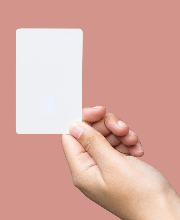
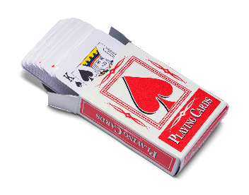
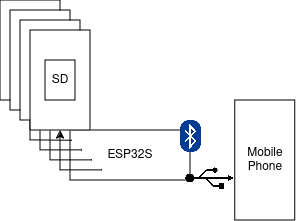

[<= Return to index](./index.md)
# Project Overview

The goal of this project is to create a proof-of-concept prototype for a novel physical media format that focuses on music. The media would be located on thin flash storage embedded into a flat rectangular volume of PVC (like an ID Card). These cards could be stored in a container shaped like a deck of cards, which would then connect to a “hat” which would read them all and send them to another device, allowing the end user to play back any music that they have stored.

  ## The MediaCard
  
  
  
  * Flash storage  
    * MicroSD for prototype  
    * BGA eMMC on a flex PCB for actual  
  * Conductive contacts  
    * Like a game cartridge, row of conductive contacts at the bottom  
    * Connects to deck box

  ## The DeckBox
  
  

  * Card Connectors  
    * On the bottom inside  
      * Conductive contacts  
    * Ideally: as many as possible  
    * Cards slot in and are held in by friction
  
  ## The Application
  
  * Limited to music for prototype  
  * Display currently connected albums allow for the creation of playlists  
    * Grey out media from disconnected cards
  
  ## Marketing Aims
  
  * Serve “hipsters” (those who enjoy the physicality of their media, i.e. vinyl records), audiophiles, and the everyday media consumer.  
  * Be more convenient than existing formats, while remaining interesting  
    * More pocketable than CDs and vinyl records  
    * More handleable than USBs and SD Cards  
    * More modern-device-capable than cassettes  
  * Average listener should be able to store their entire collection in one pocket, and connect via bluetooth or USB to their phone or other device.  
  * Provide indie music artists a fun way to get their music sold  
  * Create a proof-of-concept that showcases this idea  
    * Does not have to actually store music in the cards for the time being
  
  ## Technical Requirements

  

  * Physical components  
    * Card  
      * Represents a unique ID at the minimum  
      * Could also contain the relevant bits of data  
        * If so, MicroSD for prototype  
      * Connector is just conductive material  
        * Could use conductive tape for prototype  
    * Hat  
      * Arduino  
        * ESP32S  
          * Full 2.4GHZ WiFi/Bluetooth  
          * Ability to act as USB host  
          * Enough pins to read multiple SD Cards if required  
            * Already own arduino MicroSD readers  
        * Read data from cards  
        * Communicate with external device via Bluetooth  
          * Probably a mobile app  
          * Transmit data from cards  
  * Technical aspects  
    * Use arduino to read data from cards  
      * Have already used Arduino IDE  
      * If using SD Cards, need to use library  
    * Transmit data through Bluetooth  
      * Library for that too  
    * Create interface  
      * Familiar with the basics of mobile-capable app development
  
  ## Areas to Research
  
  * Using an embedded bluetooth device to transmit live data  
    * Updates state when physical change  
  * Create an interface for proof-of-concept  
    * Utilize some kind of development kit  
      * Flutter  
      * React Native  
      * Tauri? (Rust)  
      * Kotlin  
    * Display and arrange elements  
    * Play the relevant piece of audio when selected