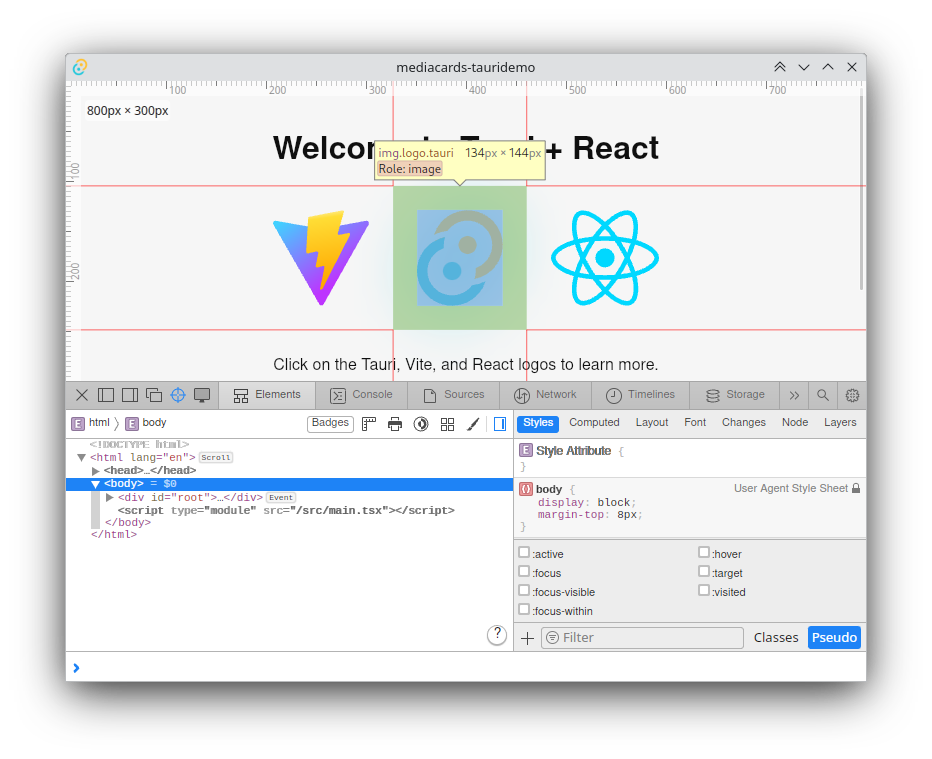
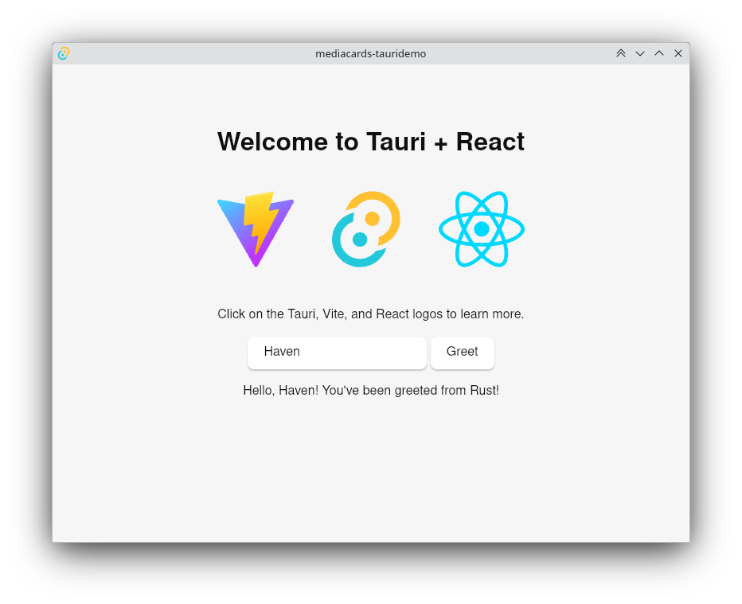
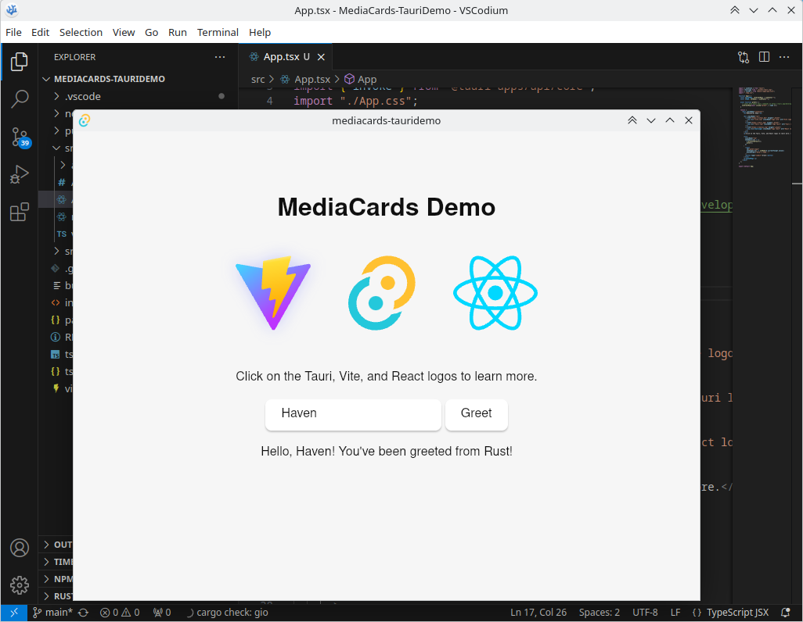

# First Meeting – 16 Jan 2025

## Summary

* Introduced the concept to my peers  
* Received feedback of my ideas presented  
  * Mostly revolved around specific strategies to achieve the physical technological goal  
  * Things mentioned: Possible use of NFC and creation of fake slots for mock up, in addition to a few real ones  
* Overall: Success

## What’s Next?

* Decide on development kit  
* Begin project initialization, i.e directory skeleton  
* Get a basic Arduino up and running

# Progress Report \- February 2025

## Log

* Did some research on best development kit for my situation  
  * Decided on Tauri/React/Bun/Typescript  
  * Tauri  
    * Gives me an excuse to learn Rust  
    * Will have no problem interacting with the Arduino  
    * Great for desktop apps, not so much mobile  
      * Made this concession to expose myself to a new language  
      * Mobile is still doable, just a bit harder  
      * May motivate me to have a separate codebase for mobile, which is not necessarily a problem  
  * React  
    * Industry standard  
    * Good for portfolio  
    * Plenty of resources, including institutional  
  * Bun  
    * Sounds cool, might make things slightly harder  
    * Works well with Typescript  
  * Typescript  
    * Works well with Bun  
      * Circular Reasoning Detected\!  
    * Static, strongly-typed all that good stuff  
    * Will make my life easier in the long run  
* Actual project creation  
  * Repository created:  
    * [https://github.com/soko7awen/MediaCards-TauriDemo](https://github.com/soko7awen/MediaCards-TauriDemo)  
  * Tauri Project initialized  
    * [https://v2.tauri.app/start/create-project/](https://v2.tauri.app/start/create-project/)

  

* Vite comes already configured  
* Learning…  
  * [https://v2.tauri.app/concept/architecture/](https://v2.tauri.app/concept/architecture/)  
    * These docs seem really good so far  
      * Even explains why reverse engineering Tauri projects is not easy  
  * [https://v2.tauri.app/concept/inter-process-communication/](https://v2.tauri.app/concept/inter-process-communication/)  
    * This one makes me nervous of what I’ve gotten myself into 😬  
  * [https://v2.tauri.app/develop/](https://v2.tauri.app/develop/)  
    * I may have skimmed a bit to get to this one 😅  
    * Opening the development server in-browser shows the same screen, but the ‘Greet’ button does nothing.  
      * Neat\!  
    * Inspect element can still be opened with Ctrl+Shift+I

  

* Successfully made a small change.

  

* Learning Session done now… time for bed.

## Up Next

* [https://v2.tauri.app/develop/calling-rust/](https://v2.tauri.app/develop/calling-rust/)  
  * Calling Rust code from React  
  * Basic React interface  
    * Just a header and a button  
  * Rust needs to interact with Arduino  
    * React button will call Rust function that tells the Arduino to cycle through a set of RGB values on the Arduino’s LED  
  * Rust \-\> Arduino  
    * Setup Arduino code for Rust to connect with.

## Any Questions?

* In what exact way will the Arduino communicate with the backend?  
  * Rust serialport library talks through USB Serial / Bluetooth Serial
